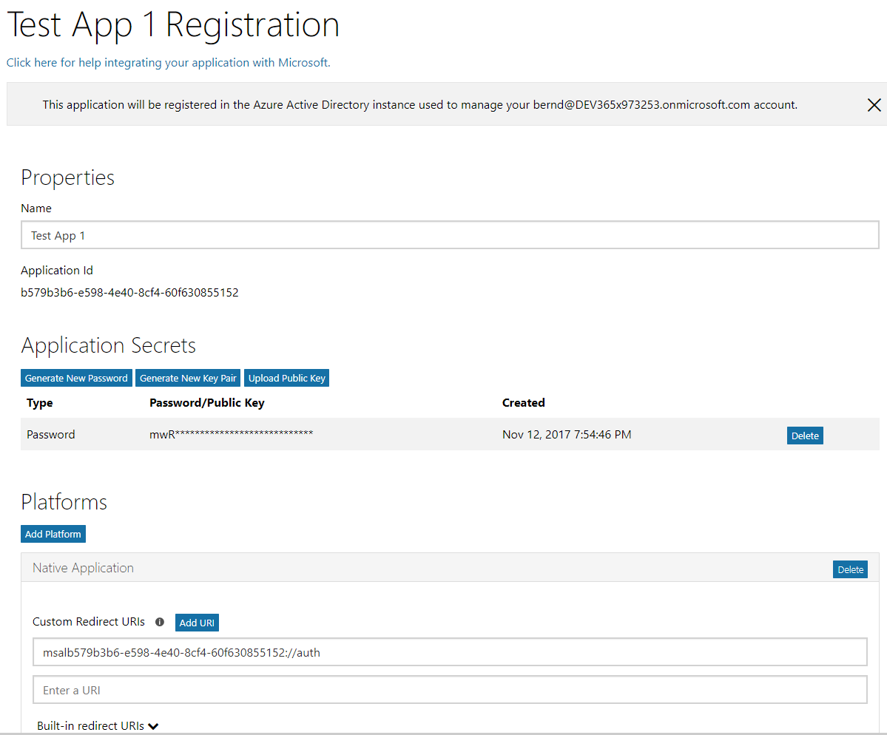

# Create Groups Hands-on Lab 08

## Steps
1. Start with console application
	1. Locate '08 - Create Groups Hands-on Lab' folder
	1. Open the 'Spbg.CreateGroupsHol.sln' with Visual Studio 2017
	1. Click on 'Manage NuGet Packages for Solution...' from context menu in solution explorer
	1. Go to the Browse tab, tick-off 'Include prerelease', search for 'Microsoft.Identity.Client' and it to the project
	1. Now, search for 'Microsoft.Graph' and it to the project
1. Register and configure Azurea AD v2 application
	1. Go to https://apps.dev.microsoft.com
	1. Login with as admin with admin@{tenant}.onmicrosoft.com
	1. Click on 'Add an app' button
		1. Enter any name for the application
		1. Click on 'Create'
			
	1. Note the application id
	1. Create an application secrect - click on 'Generate New Password'
		
	1. Add a platform - click on 'Add platform' and choose 'Native application'
	1. Go to the 'Microsoft Graph Permissions' section
		1. Under delegated permissions add: Group.ReadWrite.All
		1. Under application permissions add: Group.ReadWrite.All, User.Read.All
			
	1. Under 'Advanced options' remove the Live SDK support
	1. Click the 'Save' button	
1. Open up a browser and navigate to the consent URL at (insert your client id beforehand) https://login.microsoftonline.com/common/adminconsent?client_id=YourClientId&redirect_uri=http://localhost
1. Authenticate with app-only 
	1. Open up Program.cs
	1. Fill-out the four constants in the top with the values for your Azure AD application and Office 365 tenant, for example:
		1. ClientId: 1329f001-1190-40cc-ac7b-710bd6f4ec01
		1. ReplyUri: msal1329f001-1190-40cc-ac7b-710bd6f4ec01://auth
		1. ClientSecret: lnVWN104~;&tqstoIaauu#
		1. TenantId: DEV365x111333.onmicrosoft.com
1. Create a group with Web Client class
	```csharp
	var token = GetTokenForClientAsync().Result;

    using (var wc = new WebClient())
    {
        wc.Headers["Authorization"] = $"Bearer {token}";
        wc.Headers["Content-Type"] = "application/json";
        var body = @"{
                'description': 'Group',
                'displayName': 'Group',
                'groupTypes': ['Unified'],
                'mailEnabled': true,
                'mailNickname': 'group',
                'securityEnabled': false
            }";
        var responseJson = wc.UploadString("https://graph.microsoft.com/v1.0/groups", "POST", body);
        Console.WriteLine(responseJson);
    }
	```
1. Execute the same code one more time - observe the generic error message
1. Add error handling to the create group code
	```csharp
	var token = GetTokenForClientAsync().Result;

    try
    {
        var wc2 = new WebClient();
        wc2.Headers["Authorization"] = $"Bearer {token}";
        wc2.Headers["Content-Type"] = "application/json";
        var body = @"{
                'description': 'Group',
                'displayName': 'Group',
                'groupTypes': ['Unified'],
                'mailEnabled': true,
                'mailNickname': 'group',
                'securityEnabled': false
                }";
        var responseJson = wc2.UploadString("https://graph.microsoft.com/v1.0/groups", "POST", body);
        Console.WriteLine(responseJson);
    }
    catch (WebException e)
    {
        using (var reader = new StreamReader(e.Response.GetResponseStream()))
        {
            Console.WriteLine(reader.ReadToEnd()); 
        }
    }
	```
1. Create a group with Microsoft Graph SDK
	1. Add the code below
		```csharp
        var client = GetGraphClient();
		
        var group = new Group
        {
            Description = "Group",
            DisplayName = "Group",
            GroupTypes = new[] { "Unified" },
            MailEnabled = true,
            MailNickname = "group",
            SecurityEnabled = false
        };
        var result = client.Groups.Request().AddAsync(group).Result;
        Console.WriteLine(result.Mail);
		```
1. Execute the same code one more time - observe the GraphServiceException
1. Add Owner to an Office 365 Group, add this method to Progam.cs
	```csharp
	private static async Task AddOwnerToGroup(string groupMailNickname, string ownerUpn)
	{
		var client = GetGraphClient();

		var userFiltered = await client.Users
			.Request()
			.Filter($"userPrincipalName eq '{ownerUpn}'")
			.GetAsync();
		var user = userFiltered.First();

		var groupFiltered = await client.Groups
			.Request()
			.Filter($"mailNickname eq '{groupMailNickname}'")
			.GetAsync();
		var group = groupFiltered.First();

		var owners = await client.Groups[group.Id].Owners
			.Request()
			.GetAsync();
		if (owners == null || owners.Count == 0)
		{
			// No owners yet. Add it
			await client.Groups[group.Id].Owners.References
				.Request()
				.AddAsync(user);
			Console.WriteLine($"Owner {user.UserPrincipalName} added to group {group.Mail}");
			return;
		}

		// Test if the user is already an owner
		var ownersFiltered = await client.Groups[group.Id].Owners
			.Request()
			.Filter($"id eq '{user.Id}'")
			.GetAsync();
		if (ownersFiltered.Count == 0)
		{
			// Add 
			await client.Groups[group.Id].Owners.References
				.Request()
				.AddAsync(user);
			Console.WriteLine($"Owner {user.UserPrincipalName} added to group {group.Mail}");
		}
		else
		{
			Console.WriteLine("Owner already added");
		}
	}
	```
1. Then invoke it from Main method
	```csharp
	Task.Run(() => AddOwnerToGroup("group", $"admin@{TenantId}"))
		.GetAwaiter()
		.GetResult();
	```
